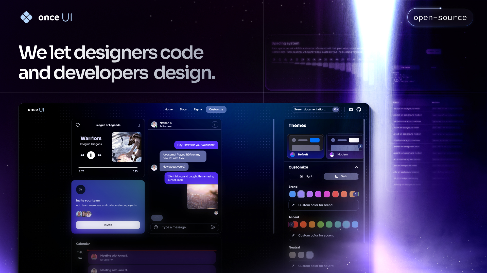

# **Portafolio de Spyflow**

Bienvenido a mi portafolio personal, donde muestro mis proyectos, habilidades y experiencia profesional.  
Este portafolio está desarrollado con Next.js y utiliza **Once UI**, un sistema de diseño versátil y ligero.  
 

Características principales:  
* **Diseño moderno y personalizable** gracias a Once UI.  
* **Componentes dinámicos y reutilizables** que permiten una experiencia de usuario fluida y atractiva.  
* **Optimización y rapidez en el desarrollo**, aprovechando la potencia de Once UI y Next.js.  
  

# **Sobre Once UI**
Once UI es el sistema de diseño que utilicé para crear este portafolio. Ofrece componentes prácticos, un sistema robusto de estilos y documentación interactiva para personalización.  
Más información en [once-ui.com/docs](https://once-ui.com/docs).  
  

# **Sobre mí**
¡Conecta conmigo!  

**Spyflow**  
- Sitio web: [spyflow.link/twitch](#)  
- LinkedIn: [cl.linkedin.com/in/javier-ferrada-riquelme](#)  
- GitHub: [github.com/spyflow](#)  
  

# **Contribuye**
Si quieres mejorar este portafolio o aprender del código:  
- Reporta un [bug](https://github.com/once-ui-system/nextjs-starter/issues/new?labels=bug&template=bug_report.md).  
- Sugiere una [mejora](https://github.com/once-ui-system/nextjs-starter/issues/new?labels=feature%20request&template=feature_request.md).  
  

# **Licencia**
Este proyecto está distribuido bajo la Licencia MIT. Consulta `LICENSE.txt` para más detalles.  
  

# **Despliega tu versión**
¿Quieres probar algo similar? Usa los botones de despliegue rápido:  

  
  
